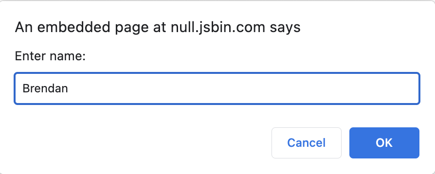

# Variablen

Schreiben Sie ein kleines Skript, das Sie zur Eingabe Ihres Namens mittels eines `prompt` auffordert, den Namen in einer Variable speichert und diesen dann auf der Konsole ausgibt.

Das Einlesen des Namens sollte wie folgt aussehen...



... und die Ausgabe so:

```js
"Your name is Brendan!"
```

### Hilfestellungen zur Lösung

### Erstellen eines Prompt
<details>
<summary>Brauchen Sie Tipps?</summary>
Um ein JavaScript `prompt` zu erstellen rufen Sie die globale Funktion mit dem gleichen Namen auf. Die Eingabe kann in einer Variable gespeichert werden.

```js
let input = prompt("I want to know: ") // Erstellt ein prompt und frägt den User "I want to know: ", die Eingabe der Users wird in der Variable input gespeichert.
```
</details>  

### Ausgabe in der Konsole
<details>
<summary>Brauchen Sie Tipps?</summary>
Konsolen-Ausgaben können mittles des globalen `console` Objekts und dessen Funktionsaufrufs `log` realisiert werden. Als Parameter wird hier der auszugebende Text angegeben. Es kann sich dabei auch um eine Variable handeln.

```js
console.log("Your console output message."); // Schreibt "Your console output message." in die Konsole
```
</details>  
