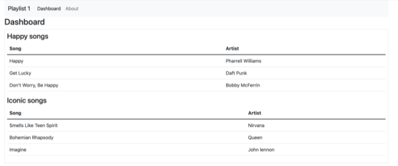

# Mehrere Playlists

Da eine einzige Playlist nur bedingt Spaß macht, wollen wir nun eine zweite hinzufügen und im View anzeigen.

## 1. Model ändern

Ändern Sie Ihr Playlist Model und fügen Sie ein zweites Objekt hinzu. Damit beide Playlists verfügbar gemacht werden, erstellen wir ein weiteres Objekt `playlistCollection`, in dem innerhalb von einem Array beide Playlists gespeichert sind.
Dieses machen wir dann durch den `export` verfügbar.

Passen Sie die Datei `models/playlist-store.js` wie folgt an:

```js
const logger = require("../utils/logger.js");

const happySongs = {
  title: "Happy songs",
  songs: [
    {
      title: "Happy",
      artist: "Pharrell Williams",
    },
    {
      title: "Get Lucky",
      artist: "Daft Punk",
    },
    {
      title: "Don’t Worry, Be Happy",
      artist: "Bobby McFerrin",
    },
  ],
};

const iconicSongs = {
  title: "Iconic songs",
  songs: [
    {
      title: "Smells Like Teen Spirit",
      artist: "Nirvana",
    },
    {
      title: "Bohemian Rhapsody",
      artist: "Queen",
    },
    {
      title: "Imagine",
      artist: "John lennon",
    },
  ],
};

const playListCollection = [happySongs, iconicSongs];

module.exports = playListCollection;
```

Das neue Model enthält jetzt zwei Arrays (`happySongs` und `iconicSongs`). Am Ende wird ein Array `playListCollection` erzeugt, dass diese beiden Arrays als Elemente enthält. Das neue Model exportiert dieses Array `playListCollection`.

## 2. Controller ändern

Ihr Controller muss nun das Array mit den beiden Playlists an das View weitergeben.

Ändern Sie zuerst die Zeile für den Import des Moduls so ab, dass das Model nicht mehr als `playList` sondern als `playListCollection` importiert wird:

```js
const playListCollection = require("../models/playlist-store.js"); // include des Models
```

Passen Sie anschließend das Objekt `viewData` so an, dass auf die neue `playListCollection` zugegriffen wird.

```js
const viewData = {
 title: "Dashboard",
 playLists: playListCollection
};
logger.info('about to render', playListCollection);
response.render("dashboard", viewData);
```

Der Controller gibt nun ein Array von zwei Playlists an Ihr View weiter.

## 3. View anpassen

Ihr View hat bis jetzt ein einzelnes Objekt erwartet, bekommt nun aber wie oben beschrieben eine Liste von Objekten.
Ändern Sie die `dashboard.hbs` wie folgt ab, damit für jede Playlist eine Tabelle erzeugt wird.

```handlebars
    {{> menu id="dashboard"}}
    <h3>Dashboard</h3>

    <div class="border p-2 my-2">
        {{#each playLists}}
            <h4>{{title}}</h4>
            {{> listsongs}}
        {{/each}}
    </div>
```

Die Zeile `{{#each playLists}}` erstellt für jedes Objekt in der übergebenen Liste einen Titel und den partiellen View. Ändern Sie den `partial` `listsongs` wie folgt ab, damit dieser auf die einzelnen Songs zugreifen kann:

```handlebars
{{#each songs}}
  <tr>
    <td>{{title}}</td>
    <td>{{artist}}</td>
  </tr>
{{/each}}
```

Die fertige Seite sollte dann wie folgt aussehen:


