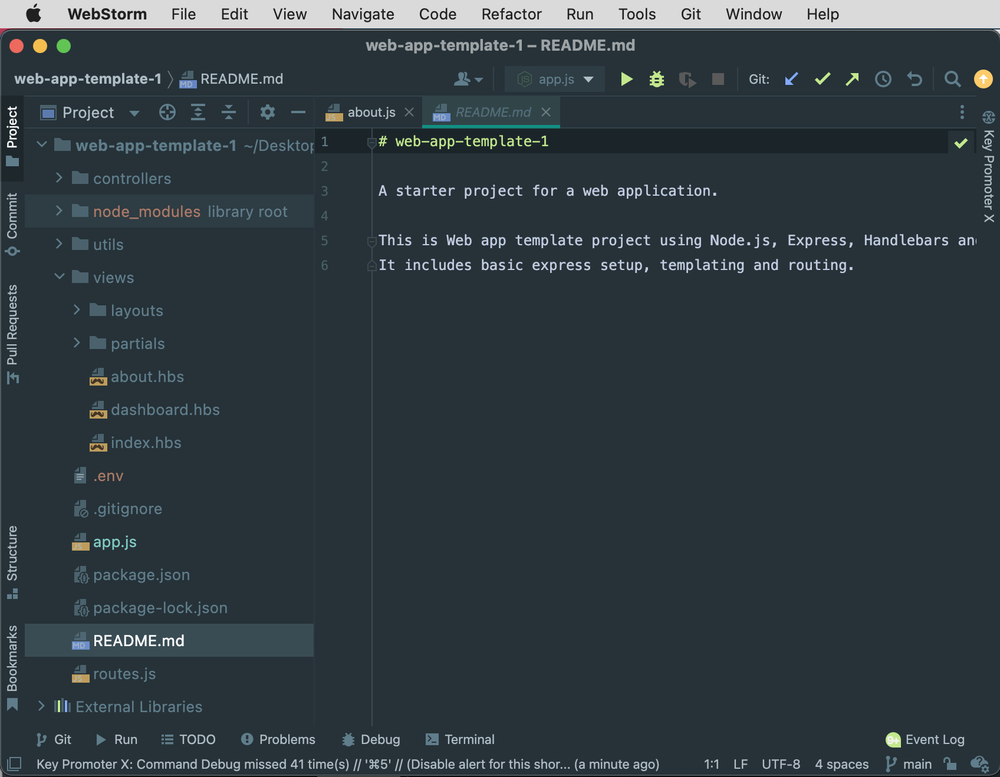

# Git

Git ist ein Tool mit dem Sourcecode versioniert und dezentral gespeichert werden kann. Vergewissern Sie sich das Git installiert ist. Dazu kann in der Kommandozeile folgender Befehl ausgeführt werden:

~~~ shell
git --version
~~~

Sollten Sie keine Antwort mit Ihrer installierten Versionsnummer erhalten laden Sie sich Git bitte hier herunter:
[https://git-scm.com/](https://git-scm.com/)

**Hinweis:**  Git ist im CIP-Pool bereits installiert.

## Klonen eines Startercodes und öffnen des Projekts in WebStorm

Sie finden unter dem [https://github.com/OTHRegensburgWebDevKIDS/web-app-template-1](https://github.com/OTHRegensburgWebDevKIDS/web-app-template-1) einen Startercode für eine einfache Web-Anwendung.

Dieser Code soll nun mit Git heruntergeladen (gecloned) werden und dann in WebStorm geöffnet werden:
Bitte öffnen Sie eine Kommandozeile und navigieren in ein leeres Verzeichnis Ihrer Wahl.
Legen Sie ein Verzeichnis (z.B. ```web-dev```) für alle kommenden Projekte an, um die Übersicht zu behalten. Die folgenden Befehle legen zuerst einen Ordner ```repos``` an, wechseln dann in diesen Ordner, erstellen einen Ordner ```web-dev``` und wechseln zuletzt auch in diesen Ordner:

~~~ shell
mkdir repos
cd repos
mkdir web-dev
cd web-dev
~~~

Klonen Sie sich dann das Beispielprojekt:

~~~ shell
git clone https://github.com/OTHRegensburgWebDevKIDS/web-app-template-1
~~~

Git erstellt dann einen neuen Ordner und lädt alle Inhalte des Github Repositories in diesen Ordner herunter.

Wählen Sie dazu in WebStorm aus dem Menü **Datei => Öffnen** oder die Option **Öffnen** direkt aus dem WebStorm Startscreeen.

Das Ergebnis sollte wie folgt aussehen:



