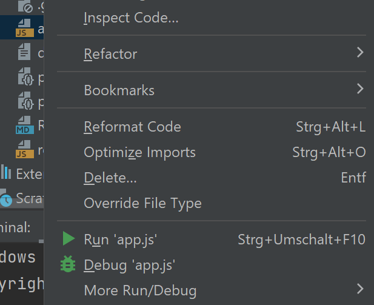
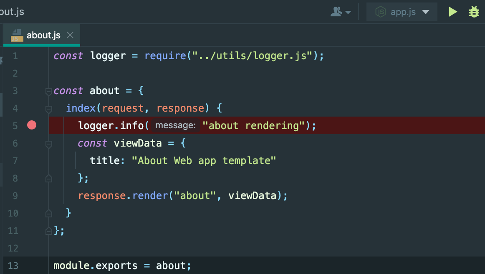

# Verwendung von WebStorm

## Übersicht

Nach dem Öffnen des Template-Projekts sieht WebStorm wie folgt aus:


## Navigation

In der Leiste am oberen Rand des Bildschirms finden Sie die Navigationsleiste. Dort können Sie alle wichtigen Einstellungen vornehmen, neue Projekte starten, bestimmte Sichten einstellen oder weitere verschiedenste Funktionen finden.

## FileExplorer

In dem FileExplorer auf der linken Seite (unter Project) können Sie die Datei Ihrer Wahl wählen und diese im Editorfenster (rechts) zur Bearbeitung öffnen.

## Editorfenster

Hier schreiben Sie Ihren Code. WebStorm unterstützt Syntax-Highlighting für nahezu alle wichtigen Web-Sprachen.

## Web App starten

Erstellen Sie eine Datei `.env` im Hauptverzeichnis des Projekts. In diese kopieren Sie folgende Zeile:

```js
PORT=4000
```

Hiermit haben Sie festgelegt, auf welchem Port Ihre Website erreichbar ist. Diese Datei wird vom Code des Template-Projekts ausgelesen.

Öffnen Sie das Terminal in WebStorm und installieren Sie dann alle für die App notwendigen Packages mit:

```shell
npm install
```

Die App können Sie dann über einen Rechtsklick auf die `app.js` Datei starten, indem Sie im Kontextmenü `Run 'app.js'` auswählen:



Wenn Sie die URL [http://localhost:4000](http://localhost:4000) im Browser öffnen sollte Ihre App geöffnet werden:


## Debugger

Der Debugger ist ein *Killer-Feature* von WebStorm und erlaubt es den Ablauf des Programms anzuhalten, und den Zustand des Programms zur Laufzeit zu analysieren und das Programm Schritt für Schritt auszuführen. Wenn Sie den Debugger richtig einsetzen reduzieren Sie die Zeit für die Suche nach Fehlern erheblich, da Sie nicht mehr raten müssen was nicht funktioniert sondern die Fehler schnell und sicher identifizieren können.

Öffnen Sie die Datei `about.js` und setzen einen Breakpoint in Zeile 5 durch Klick auf den **Gutter**, d.h. die Spalte zwischen Editor und Zeilennummern:



Stoppen Sie die Web App, falls noch nicht geschehen, durch Klick auf das rote Viereck. Starten Sie die Web App anschließend im Debug-Modus durch Klick auf den **grünen Käfer**.

Öffnen Sie anschließend im Browser die folgende URL (die Webseite sollte sich öffnen):

[http://localhost:4000](http://localhost:4000)

Klicken Sie jetzt im Browser auf den Link zur Seite *About*. Jetzt sollte WebStorm im Vordergrund erscheinen und die Ausführung der Web App am Breakpoint stoppen:


Experimentieren Sie mit den blauen, und roten Buttons des Debuggers. Im Fenster **Variables** wird Ihnen der Zustand aller Variablen angezeigt, die sich gerade im Scope befinden.
