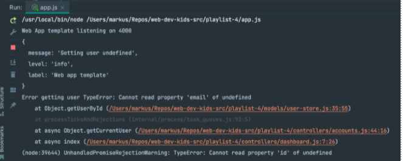

## Selektives Playlist Anzeigen

Damit nicht jeder Nutzer jede Playlist bei sich auf dem Dashboard sieht, müssen wir nun den Controller anpassen.

Um nur die Playlists anzuzeigen, die dem aktuell angemeldeten User gehören, müssen Sie herausfinden, wer genau der aktuelle User ist.
Dazu haben wir vorhin bereits eine Funktion `getCurrentUser(request)` innerhalb des Account Controllers implementiert, die Sie nun nutzen können. Die im Controller implementierte Funktion bezieht die User-ID dabei aus der aktuellen Session.
Importieren Sie dazu die Datei `accounts.js` wie folgt:
~~~ js
const accounts = require("./accounts.js"); 
~~~

Aktualisieren Sie nun die `index.hbs` Datei, sodass die `index`-Funktion wie folgt aussieht:
~~~js
async index(request, response) { 
  const loggedInUser = await accounts.getCurrentUser(request); 
  const playLists = await playlistStore.getUserPlaylists(loggedInUser.id); 
  const viewData = { 
    title: "Playlist Dashboard", 
    playlists: playLists, 
  }; 
  logger.info("about to render dashboard", playLists); 
  response.render("dashboard", viewData); 
}, 
~~~
Die neue Version des Controllers übergibt unserem Model (`playlist-Store.js`) den aktuellen Nutzer, damit das Model nun aus der Datenbank nur noch die Playlists bezieht, die zu dem aktuellen User gehören.

Genau diese Funktionalität muss nun sichergestellt werden. Modifizieren Sie die Funktion `getUserPlaylists` wie folgt:
~~~js
async getUserPlaylists(email) { 
  const query = 'SELECT * FROM playlist4_playlists WHERE user_id=$1'; 
  const values = [email]; 
  try { 
    let result = await dataStoreClient.query(query, values); 
    return result.rows; 
  } catch (e) { 
    logger.error("Error fetching playlists for user: ", e); 
  } 
}, 
~~~

Die Query an die Datenbank ist nun so modifiziert, dass Sie über die `WHERE` Klausel überprüft, ob Playlists zum User gehören oder nicht.
Der dazu genutzte Parameter ist die, der Funktion übergebenen E-Mail des aktuell angemeldeten Users.

Neben der Funktion, die alle Playlists aus der Datenbank abruft, muss außerdem die `AddPlaylist` Funktion im gleichen Model angepasst werden.
Die aktualisierte Implementation sollte dann so aussehen:

~~~ js
async addPlaylist(playList) { 
  try { 
    const query = 'INSERT INTO playlist4_playlists (TITLE, USER_ID) VALUES($1, $2)'; 
    const values = [playList.title, playList.userid]; 
    await dataStoreClient.query(query, values); 
  } catch (e) { 
    logger.error("Error cannot add playlist", e); 
  } 
}, 
~~~

Auch hier wird nur, neben dem Playlist Titel auch der user in die Datenbank eingefügt.

Wichtig für die Korrektheit dieser Funktion ist dabei auch, dass die Funktion ein Objekt `playlist` enthält, in dem die UserId bereits enthalten ist.
Dafür muss im letzten Schritt noch der Controller des Dashboards angepasst werden, der die Funktion aufruft.

Modifizieren Sie dazu die Datei `controllers/dashboard.js`, sodass die `addPlaylist(...)` Funktion wie folgt aussieht.
~~~ js
  async addPlaylist(request, response) {
    const newPlayList = {
      title: request.body.title,
    };
    logger.debug("Creating a new Playlist", newPlayList);
    await playlistStore.addPlaylist(newPlayList);
    response.redirect("/dashboard");
  }
~~~

Nun kann die App getestet werden. Starten Sie den Server neu und öffnen Sie Ihre Seite. 
Sie werden in Ihrer Console dabei folgenden Fehler feststellen. Statt der Playlist erhalten Sie einen Fehler, dass `email` **Null** ist.

Folgende Fehler bekommen Sie:

Diese Fehlermeldung erscheint, da Sie sich nicht angemeldet haben, und somit die Session noch nicht initialisiert ist. Somit ist auch das UserAttribut in der Session, mit dem Sie versuchen Ihre Playlists abzufragen noch nicht initialisiert.
