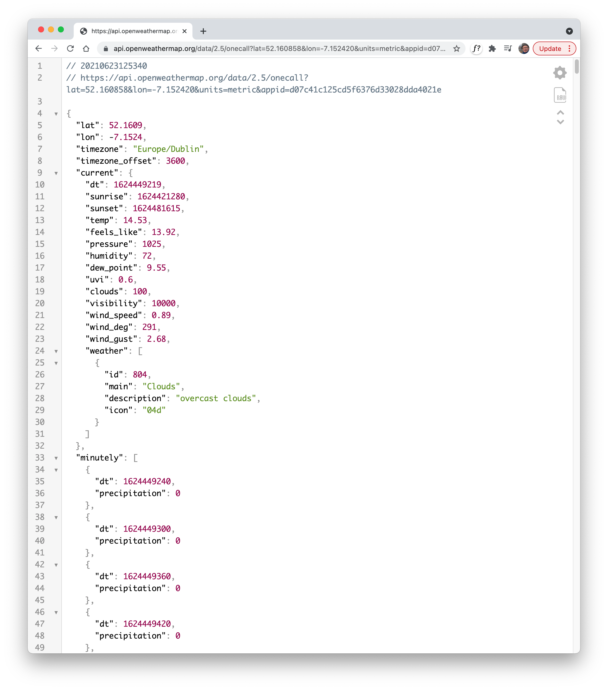

## API Requests

Nun, wo Sie Axios installiert haben, können wir Daten für unsere Applikation abrufen. 
Aus dem letzten Lab **OpenWeatherApi** sollten Sie die Funktion der API bereits kennen.

Mit dem Request:
```text
    https://api.openweathermap.org/data/2.5/onecall?lat=52.160858&lon=-7.152420&units=metric&appid=YOUR_API_KEY_HERE
```
können Sie das Wetter für einen spezifischen Ort abfragen, nachdem Sie Ihren API Key in den String eingebaut haben.
Die Antwort im Browser sollte wie folgt aussehen:



Nun kann die API in unsere Applikation integriert werden.
Innerhalb des Dashboard Controllers sollen die Daten von der API abgefragt
werden und dann direkt angezeigt werden.

Nehmen Sie dazu folgende Änderungen am Controller vor:

### controllers/dashboard.js

Importieren Sie zu Beginn der Datei das Axios Paket:
```js
const axios = require("axios");
```

Über einen einfachen String können wir für dieses Experiment die Koordinaten, für die uns das Wetter interessiert, auch statisch vergeben.
Denken Sie daran Ihren API Key einzufügen.
```js
const oneCallRequest = `https://api.openweathermap.org/data/2.5/onecall?lat=52.160858&lon=-7.152420&units=metric&appid=YOUR_KEY_HERE`
```

Dann kann die API innerhalb der `Addreport` Funktion wie folgt genutzt werden.
```js
  async addreport(request, response) {
    logger.info("rendering new report");
    let report = {};
    const result = await axios.get(oneCallRequest);
    if (result.status == 200) {
      const reading = result.data.current;
      report.code = reading.weather[0].id;
      report.temperature = reading.temp;
      report.windSpeed = reading.wind_speed;
      report.pressure = reading.pressure;
      report.windDirection = reading.wind_deg;
    }
    console.log(report);
    const viewData = {
      title: "Weather Report",
      reading: report
    };
    response.render("dashboard", viewData);
  }
```

Sobald Sie durch einen Button Press diese Funktion starten, wird ein API Request an die OpenWeatherAPI gesendet.
Ist der Statuscode der Api Antwort *200* (**OK**), werden uns die angefragten Daten wie erwartet zurückgegeben.
Die Nutzdaten können dann aus dem JSON Antwort-Objekt rausgelesen werden und an das View überreicht werden.

**Tipp**: Eine Dokumentation der HTTP-Status Codes finden Sie [zum Beispiel in der Mozilla Dokumentation](https://developer.mozilla.org/de/docs/Web/HTTP/Status).

Der Report sollte dann nach einem Knopfdruck wie folgt aussehen:


