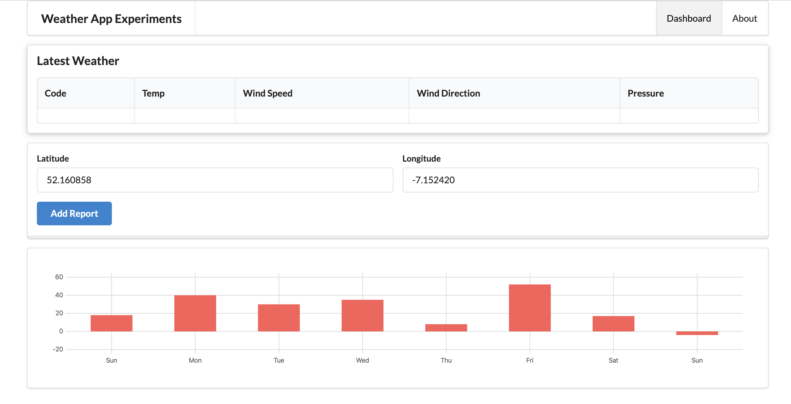
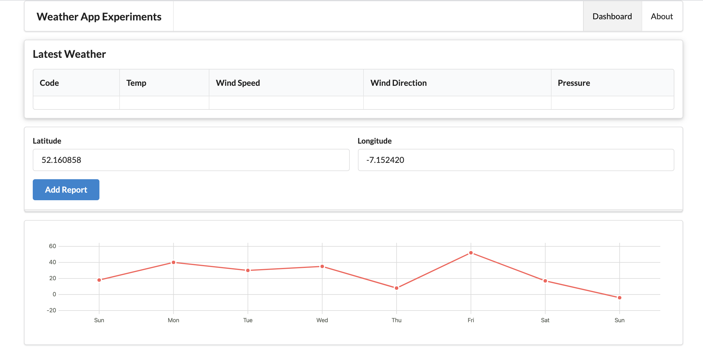

## Graphiken

Graphiken können von Handlebars oder Javascript nicht out-of-the-Box erstellt werden, sodass auf Pakete zugegriffen wird.
Unter einer Vielzahl von open-Source Modulen ist eine sehr beliebte Wahl die **Frappe** Library.

Frappe ist eine Client-Side Library. Das heißt wir können die Funktionalität über ein Inkludieren in unseren Views sicherstellen.

Fügen Sie dazu neben den anderen Includes folgende Zeile in der Main.hbs Datei ein.

### views/layouts/main.hbs
```js
 <script src="https://cdn.jsdelivr.net/npm/frappe-charts@1.2.4/dist/frappe-charts.min.iife.js"></script>
```

Dadurch ist die Library auf allen Seiten verfügbar.
Um die Funktionsweise zu verifizieren, lassen sich verschiedene [Beispiele aus der Dokumentation](https://frappe.io/charts/docs/basic/basic_chart) testen.

Fügen Sie für einen Test folgende Codezeilen an das Dashboard an.
Im Data Objekt finden sie Demo-Daten für die Erzeugung eines Diagramms. 
Die Daten müssen nach diesem Beispiel dynamisch werden.
Mit dem Code `new frappe.` wird die Grafik initialisiert.

###views/dashboard.hbs
```handlebars
<div class="ui segment" id="chart"></div>
<script>
  data = {
    labels: ["Sun", "Mon", "Tue", "Wed", "Thu", "Fri", "Sat", "Sun"],
    datasets: [
      { values: [18, 40, 30, 35, 8, 52, 17, -4] }
    ]
  };
  new frappe.Chart("#chart", {
    data: data,
    type: "bar",
    height: 180,
    colors: ["red"]
  });
</script>
```

Die Seite sollte dann wie folgt aussehen:


Innerhalb des eingefügten Codes finden Sie eine Stelle `type: "bar"`. 
Mit diesem Attribut können Sie den Diagrammtyp ändern.
Ändern sie die Grafik in einen LineChart:
``` js
  new frappe.Chart("#chart", {
    data: data,
    type: "line",
    height: 180,
    colors: ["red"]
  });
```

Das Ergebnis sieht dann so aus:

